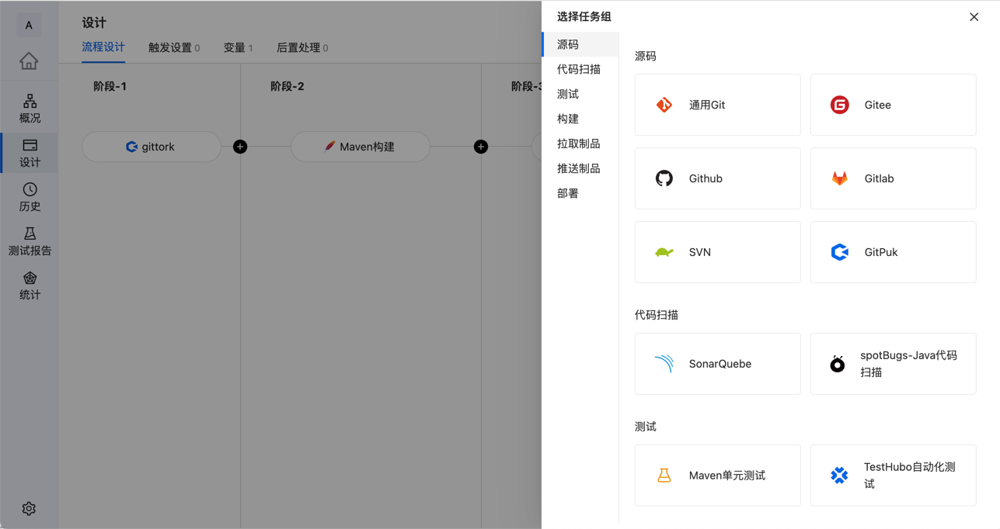
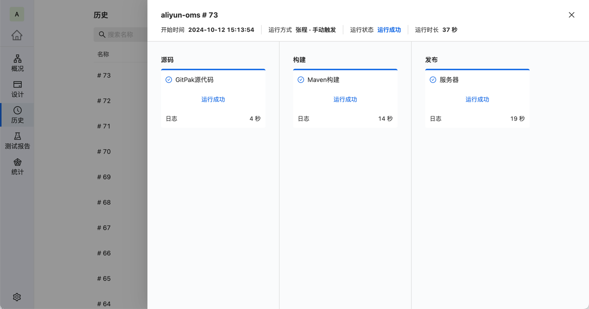
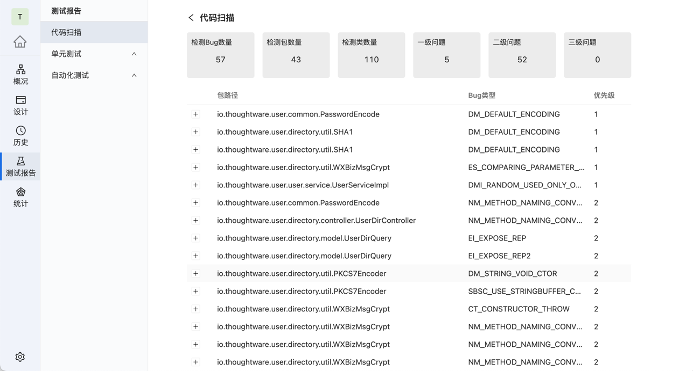

<h1 align="center" style="border-bottom: none">
    
      Arbess 
</h1>

# Arbess - 开源的持续集成/持续交付 (CI/CD) 工具
Arbess 是一款强大的开源 CI/CD 工具，旨在帮助开发团队高效管理构建、测试和部署流程。它提供了丰富的功能，支持多种主流开发工具和平台，是现代软件开发流程中不可或缺的利器。

## 主要功能

### 1. 持续集成 (CI)
- 支持多任务并行和串行执行。
- 全面覆盖源码管理、代码扫描、测试、构建和部署等环节。
- 自动触发流水线，提升系统迭代效率。
  

### 2. 持续交付 (CD)
- 支持多种部署环境，包括主机、云主机、Docker 和 Kubernetes。
- 透明、可控的部署流程，确保部署安全稳定。
- 快速部署到生产环境，满足快速迭代和发布的需求。

### 3. 自动化测试
- 自动执行预设的单元测试和代码扫描，减少遗漏。
- 集成 TestHubo 自动化测试，全面测试程序。
- 大幅提升测试覆盖率，保证产品质量。

### 4. 无缝集成
- 支持与主流开发工具无缝集成，如 Git 和 Docker。
- 降低迁移和适应成本，让团队快速上手。

## 产品优势
- **简洁易用**：操作界面简洁直观，非技术人员也能轻松上手。
- **多版本支持**：提供公有云和私有云版本，支持 Windows、Mac、Linux 等平台。
- **强大的集成能力**：与 Git、Docker、Kubernetes 等主流工具无缝集成。
- **安全可靠**：内置多层安全机制，确保用户数据隐私和系统安全性。
- **开源免费**：适合各类企业和个人开发者。

## 安装

### 系统要求
- Node 14+
- Npm 6.14+

### 构建项目

#### 克隆
`git clone https://github.com/tiklab-project/tiklab-arbess-ui.git`

#### 配置npm仓库
`npm config set registry https://mirror.tiklab.net/repository/tiklab-npm`

#### 启动操作
`cd tiklab-arbess-ui`

`npm install`

`npm run arbess-start`

#### 启动访问
1. 打开浏览器，访问 http://localhost:3000
2. 登录信息，用户名：admin 密码：123456。

### 贡献
我们欢迎社区的贡献！如果你有好的建议或发现了问题，请通过以下方式联系我：

[联系我们](https://tiklab.net/account/workOrder/add)

邮箱: tiklab@163.com

如需了解更多信息，请访问我们的官方网站或加入我们的社区讨论：

[官方网站](https://www.tiklab.net)

邮箱: tiklab@163.com

#### 立即体验 Arbess，解锁高效的自动化构建、测试和部署流程！

